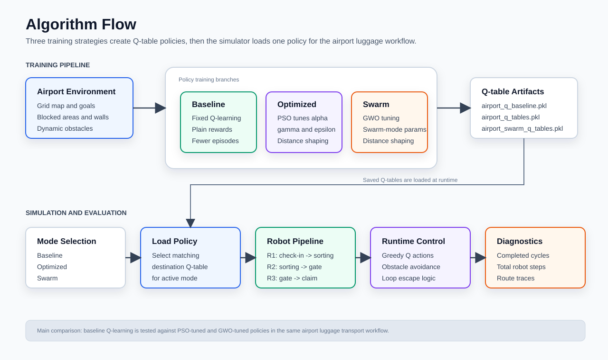

# Airport Luggage Robot Planning

A fully functional reinforcement learning simulation of a multi-robot baggage transport workflow inside an airport. The system coordinates three robots across a grid-based airport map while comparing baseline Q-learning, PSO-optimized Q-learning, and GWO-based swarm-mode Q-learning policies.

The project focuses on discrete robot navigation, route coordination, dynamic obstacle avoidance, and policy comparison across multiple advanced training strategies.

## Tech Stack & Core Skills

- **Machine Learning:** Reinforcement Learning, Q-Learning
- **Advanced Algorithms:** Particle Swarm Optimization (PSO), Grey Wolf Optimizer (GWO), Hyperparameter Optimization
- **Robotics & Simulation:** Multi-Agent Robot Coordination, Discrete Path Planning, Dynamic Obstacle Avoidance
- **Frameworks & Languages:** Python, Pygame, Jupyter Notebook

## System Architecture & Methodology

**Simulation Environment**
- **Three-Robot Baggage Pipeline:** Robot 1 moves luggage from check-in to sorting, Robot 2 moves it from sorting to the assigned gate, and Robot 3 moves it from the gate to baggage claim.
- **Airport Grid:** Includes functional zones like check-in, sorting, gates, baggage claim, waiting areas, a coffee shop, walls, and restricted zones.
- **Dynamic Obstacles:** Simulates moving people or blocked paths that robots must actively avoid during navigation.

**Learning Approaches**
| Mode | Method | Purpose |
| --- | --- | --- |
| Baseline | Q-learning | Trains destination-specific Q-tables using a simple reward structure and fixed hyperparameters. |
| Optimized | Q-learning + PSO | Uses Particle Swarm Optimization to dynamically tune alpha, gamma, epsilon decay, and minimum epsilon before retraining improved policies. |
| Swarm | Q-learning + GWO | Uses Grey Wolf Optimizer logic to tune a swarm-mode learning setup. |

**Algorithm Flow**


## Results & Metrics

The project compared the three modes offline using diagnostics (step counts, revisits, path lengths) over an approximately 100-second simulation window:

| Mode | Completed Cycles | Total Robot Steps |
| --- | ---: | ---: |
| Baseline Q-learning | 8 | 1273 |
| PSO-optimized Q-learning | 9 | 1280 |
| GWO swarm mode | 9 | 1259 |

*The baseline policy was functional, while the optimized and swarm modes completed more cycles in the reported run. The swarm mode achieved the same number of cycles as the optimized mode but required fewer total robot steps, demonstrating superior efficiency.*

## Repository Structure

```text
airport_luggage_robot_planning.ipynb   Final simulation and training pipeline
airport_q_baseline.pkl                 Pretrained baseline Q-learning policies
airport_q_tables.pkl                   Pretrained PSO-optimized Q-learning policies
airport_swarm_q_tables.pkl             Pretrained GWO/swarm-mode Q-learning policies
assets/                                Runtime image assets used by the Pygame simulation
requirements.txt                       Python dependencies
```

## Requirements & Build

If you wish to run this simulation locally:
- Dependencies can be installed via `pip install -r requirements.txt`.
- Open `airport_luggage_robot_planning.ipynb` to execute the pipeline.
- Ensure the `assets/` folder and the three `.pkl` Q-table artifacts remain in the repository root.
- You can run the Pygame GUI/environment cell directly using the included pretrained policies, bypassing the need to retrain the agents from scratch.
